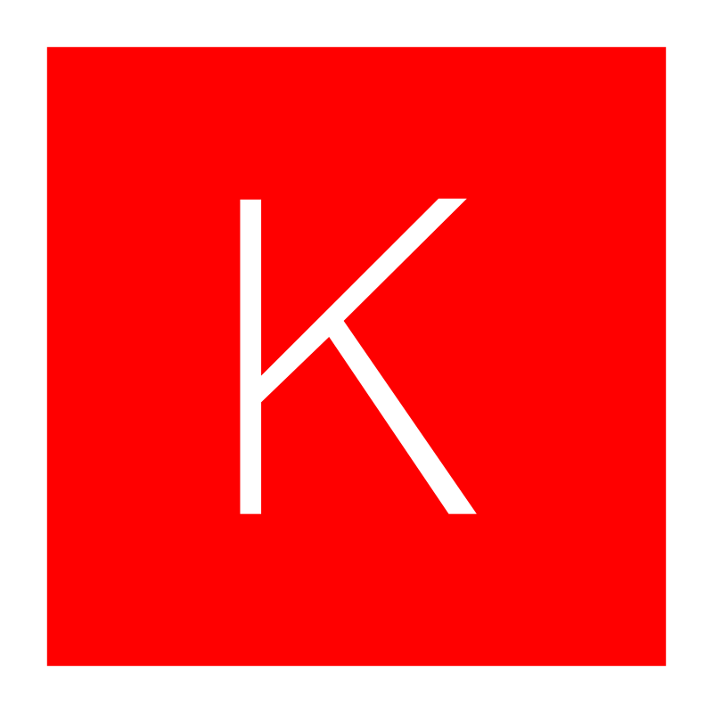

)

### Hi there!👋
I'm Sepideh, ML engineer, PhD candidate, Researcher and Programmer.

### Technologies 💻

    <a href="https://www.python.org/"> 
    
    
    
    

    
    
    
    
    

    
    
    
    
    

    
    
    
    
    

### Stats 📈

    
    

<!--  -->

<!--
**sepidehkhakzad/sepidehkhakzad** is a ✨ _special_ ✨ repository because its `README.md` (this file) appears on your GitHub profile.

Here are some ideas to get you started:

- 🔭 I’m currently working on ...
- 🌱 I’m currently learning ...
- 👯 I’m looking to collaborate on ...
- 🤔 I’m looking for help with ...
- 💬 Ask me about ...
- 📫 How to reach me: ...
- 😄 Pronouns: ...
- ⚡ Fun fact: ...
-->

